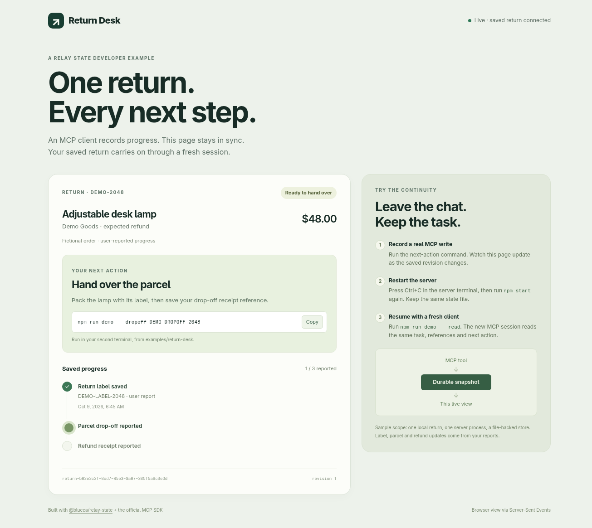

# Independent reuse evidence

Verified October 9, 2026, using Node.js 26.10.0, Chromium 153 and the official MCP SDK 1.32.1.

## Packaged second consumer

Return Desk was copied to a separate directory and installed from the public GitHub Release URL with ordinary `npm install`. Its imports of `@blucca/relay-state` and `@blucca/relay-state/http` resolved to the installed package inside that consumer's own `node_modules`.

Artifact: **`@blucca/relay-state@0.1.1`**, 7,087-byte compressed package, zero runtime dependencies.

SHA-256:

```text
5d4bf4c901ec0783c12c8c722152a5f1cfbea10b78bad4d68d690d57cee4f6ff
```

The public download returned HTTP 200 and matched this SHA-256 byte for byte. npm 12.2.0 used the consumer’s committed `allow-remote=root` setting. [Structured run summary](reuse-evidence.json).

The [Return Desk instructions](../examples/return-desk/README.md) reproduce the workflow through its official SDK CLI. Each command creates a fresh MCP client process. The browser observes the same committed object over SSE.

| Action | Observed result |
| --- | --- |
| Open browser, then `demo -- read` | Saved return at revision 0; next action **Save the return label**. |
| External `demo -- label DEMO-LABEL-2048` | Existing tab advanced to revision 1 and **Hand over the parcel**. |
| Terminate server and launch a new process with the same file | Existing tab reconnected. A fresh MCP read returned the exact revision-1 snapshot, including the task ID and label reference. |
| `demo -- dropoff …`, then `demo -- refund …` | Existing tab reached **Return complete**, revision 3, with all three reported references. |

Across the whole sequence: **one main-frame navigation**, the same in-page continuity marker, and **zero browser page errors**. The 390px layout had zero horizontal overflow.



All order details, receipt references and user reports are synthetic. The displayed $48 is the example's expected refund amount.

## Original application

[Recall Relay's server](https://github.com/blucca/recall-relay/blob/main/src/server.mjs) uses the same package with its existing household JSON shape and public `{ ok, case, change }` event format. The domain engine retains model matching, remedy rules, request identifiers and revision checks.

After integration, its existing MCP smoke completed tool discovery, the remedy workflow, idempotent replay and a server-process restart. Its event smoke confirmed external MCP write → saved revision → SSE snapshot, reconnect and stream shutdown.

## Small library checks

Six focused automated checks passed: serialized commit ordering and reopen; declined/invalid/failed reducers; failed file replacement; isolated observers and queue draining; malformed saved-file recovery; and SSE initial state, commit delivery, reconnect and close.

A TypeScript 7.0.2 strict NodeNext consumer compiled both package exports, inferred its projected view, and checked successful and declined transaction shapes. Runtime and type-level synchronous-projection requirements are covered.

The package, two application source trees and the explicit operating contract make this pattern available for another local workflow with its own schema.
